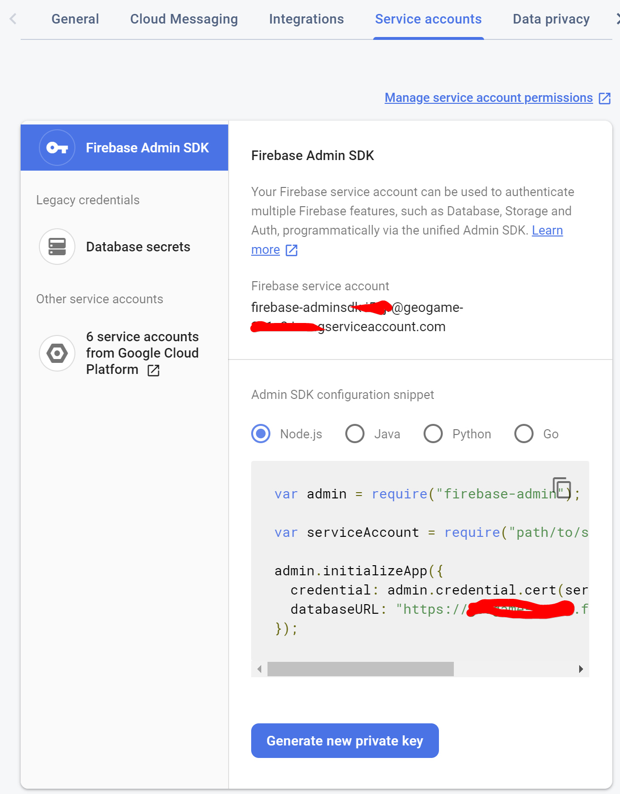
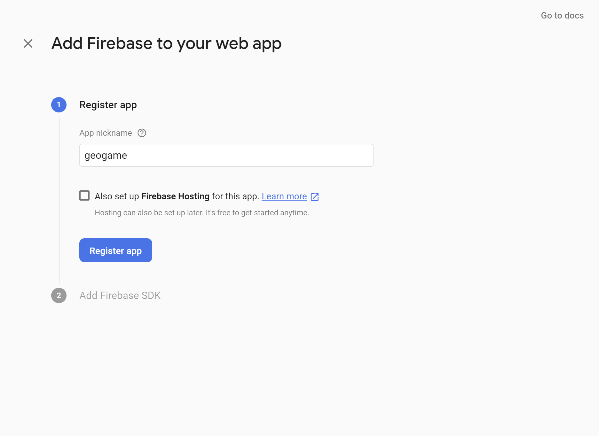
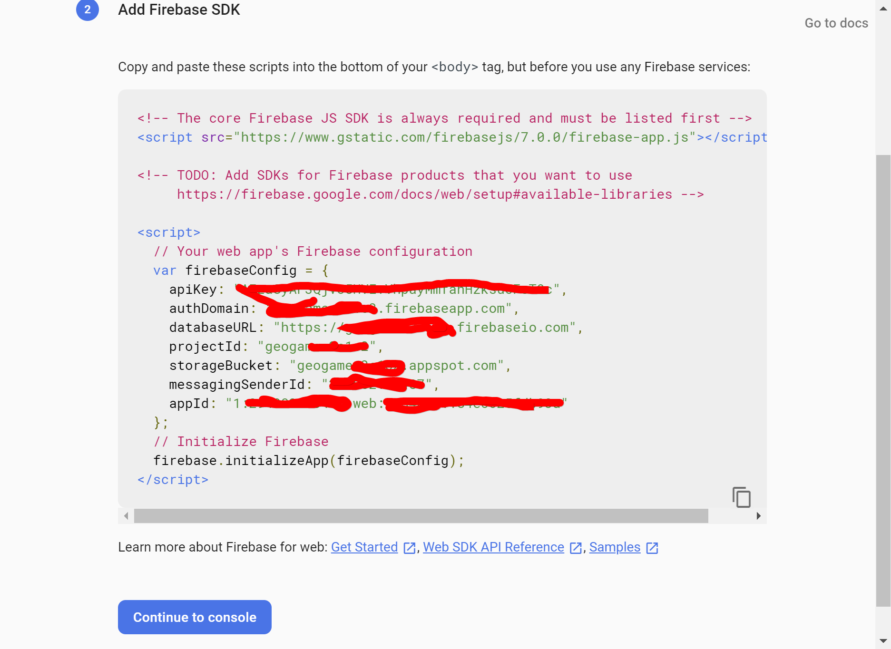

# node_geogame

Node.js project is for Loading data in to the Firebase Database from the [GeoGame](https://github.com/Thro42/flutter_geogame). I found a description on ["How to upload data to Firebase Firestore Cloud Database"](https://medium.com/@impaachu/how-to-upload-data-to-firebase-firestore-cloud-database-63543d7b34c5) an I used this to wirite as small Node.js script to load a json File to my geogame dazabase.

## preparing firebase

To use the script you nead a *serviceAccount.json* file. go to "Project settings" and "Service accounts" and press *"Generate new private key"*

The File yo get, copy as *serviceAccount.json* the same directory of the script. Now create a web app. Name them for example geogame

All the keys you get in next dialog fill in the file *firebaseconfig.json*

open a console. Go to the directory of the script and enter
 `npm install`

## using

 `node import-csv.js <json_file_name>`

